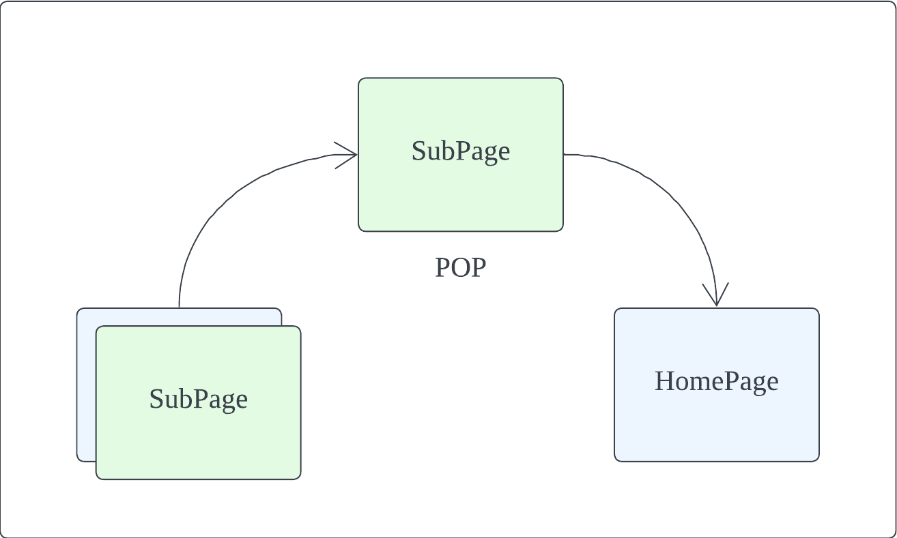
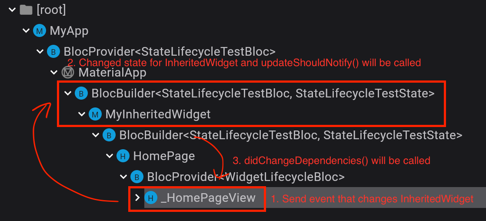

# my_flutter_lifecycle_test

To check the lifecycle from StatefulWidget, AppLifecycle and RouteAware.

## Introduction
This document organized functions that can be used frequently while implementing business requirements or whose exact calling time must be known.
Those functions are lifecycle functions for _**AppLifecycleState, RouteAware and State**_ and I will organize these three.
To organize these, I created a demo app, and you can check when each function is called through the demo app.

## AppLifecycle
There are two ways for checking AppLifecycle.
- WidgetBindingObserver
- AppLifecycleListener (from Flutter 3.13, [more details](https://api.flutter.dev/flutter/widgets/AppLifecycleListener-class.html))

In the image above, the blue area is the AppLifecycleState that can be found in WidgetsBindingObserver.
However, Starting from 3.13, it became possible to observe the lifecycle in more detail via AppLifecycleListener.

### What's different?
Let me explain with example. When an app moves to the foreground, to the background, and back to the foreground, the lifecycle is as follows.

#### WidgetsBindingObserver
resumed -> inactive -> hidden -> paused -> hidden -> inactive -> resumed

#### AppLifecycleListener
onResume -> onInactive -> onHide -> onPause -> onRestart -> onShow -> onResume

#### More information about AppLifecycleListener
- AppLifecycleListener can check the point at which the app exists
- AppLifecycleListener also can check WidgetBindingObserver's AppLifecycleState

### Caution when using
If there are multiple pages in the Navigator stack, there may be problems.

Look at this widget tree.

I've connected a WidgetsBindingObserver (or AppLifecycleListener) to the _**\_HomePageView widget**_, with the views of two SubPage widgets above it.
At this time, _**\_HomePageView**_ is in an invisible state and cannot be seen by the user.

And if the app is moved to the background and then to the foreground, AppLifecycle events are delivered to _HomePageView.
Therefore, it must be used with caution to avoid unnecessary waste of resources.

## RouteAware
AppLifecycle is specialized in observing the overall app cycle. It does not tell you whether the widget is visible to the user or not.

How do I observe the status of a widget? Among many methods, we recommend using RouteAware!

In this demo app, you can check the flow as below. After setting HomePage to detect events about RouteAware, expose SubPage on top of it. Or you can expose a dialog.

Then you can check the following four methods: Like the example below.

| Step                                   | RouteAware                                      | Description                                                                                                                                                                                  |
|----------------------------------------|-------------------------------------------------|----------------------------------------------------------------------------------------------------------------------------------------------------------------------------------------------|
|         | Callback _**didPush()**_ in HomePage widget     | Detects when the HomePage widget is added to a Route.                                                                                                                                        |
|  | Callback _**didPushNext()**_ in HomePage widget | Detects when another page is added on top of HomePage. Even if multiple pages are added, it is only called when the view directly above itself in the stack is added. When a dialog is displayed, it may appear dim or may be completely obscured by another page.                       |
|   | Callback _**didPopNext()**_ in HomePage widget  | Detects when another Page is removed from above the HomePage. Even if multiple pages are added and removed, it is only called when the view directly above itself is removed from the stack. |
|           | Callback _**didPop()**_ in HomePage widget      | Detects when HomePage is removed from a Route. The HomePage view is no longer visible to the user.                                                                                           |

## State of StatefulWidget

This demo lets you check the exact timing of calls to _**didChangeDependencies() and didUpdateWidget()**_ in the StatefulWidget widget.

There are several functions for the life cycle, but these two functions are more difficult to distinguish than other functions. So check these two functions.

### didChangeDependencies()
_**didChangeDependencies()**_ is usually called in the following situations:

- When a State is created
- When an InheritedWidget is changed

The call to didChangeDependencies() is affected by InheritedWidget(). The state of InheritedWidget() changes, updateShouldNotify() is called through the framework, and if it returns true, didChangeDependencies() is called on the child widget.

Let's look at the code above.

This is _**MyInheritedWidget**_ with _**int id**_ as the status value. And check the change in _**id**_ in the updateShouldNotify() function. When the id changes, the change is notified to the child widget.

Below is the flow and Demo screenshot until didChangeDependencies() is called.

|Flow|Demo screenshot|
|----------------------------------------|-------------------------------------------------|
| | |

### didUpdateWidget()
_**didUpdateWidget()**_ is called when the state of the parent widget changes, thereby changing the parameters passed to the constructor of the widget itself.

In this demo, you update the parameters you will receive through a button. The flow and results are as follows.

|Flow|Demo screenshot|
|----------------------------------------|-------------------------------------------------|
| | |
